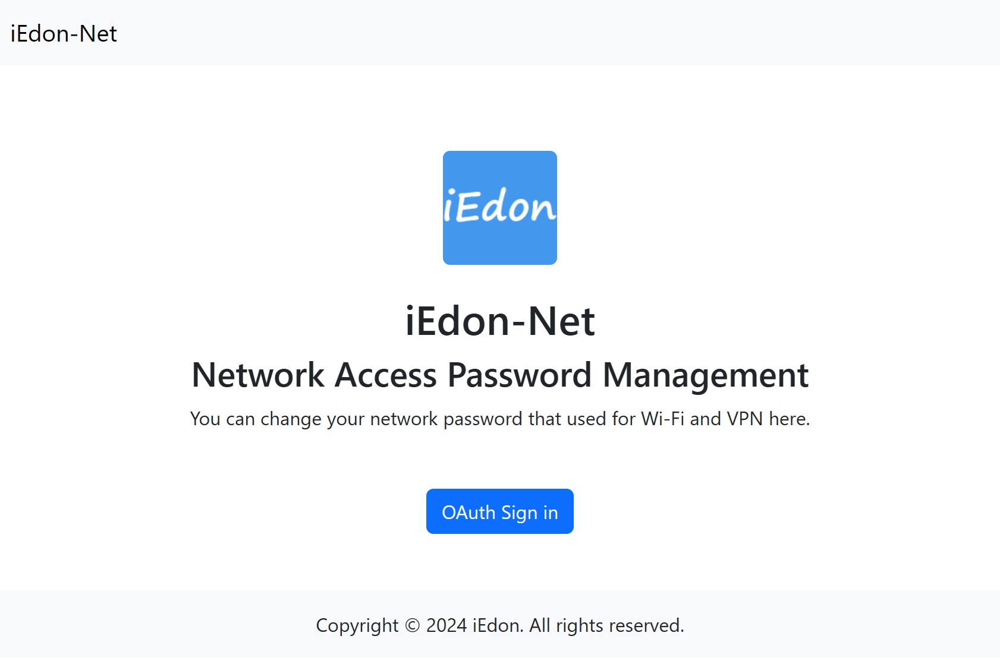
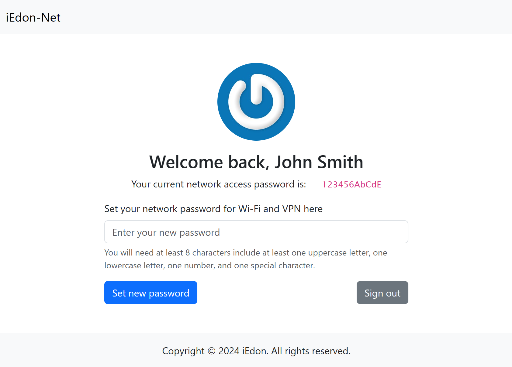

# IEDON-NET-NETPASS

Something werid PoC to integrate with iEdon-Net, enables changing Wi-Fi password by authenticating with `Authentik`.

# Feature
- OAuth / OpenID Connect with `Authentik`
- Modify a user's network access password, using internal service account with limited privileges, in user's attributes

# Usage
- Create a service account(e.g. `netpwdmgr`) in `Authentik` with privileges(`Can view/edit users` and `Can view groups`)
- Create API token for `netpwdmgr` and fill `.env`
- Generally set up OpenID provider in `Authentik` with Subject mode `Based on the User's ID` and application

# Memo
- Cookie only works under `HTTPS`
- Using `bun` and `Hono.js`

# Related post

My Wi-Fi EAP Password Authentication: https://iedon.com/2023/12/24/1185.html

EAP Radius server configured to auth with a LDAP Provider from `Authentik`.

# Screenshot

